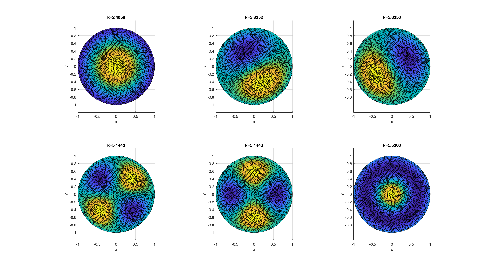

(markdown [ref](https://guides.github.com/features/mastering-markdown/))

### 04/04/2018

Following Section 9.2.3 in *Theory and Computation of Electromagnetic Fields* by Jian-Ming Jin, 2nd edition.

Got the first few TM modes.

#### TODO
- [x] figure out the eigenvalues k_c ^ 2 = 10^4 * [ 0.4120    0.6353    1.3346    1.0153 ... ]

### 04/05/2018

Fix getAB() function. Test on circular waveguides. Got TM modes as shown here,

